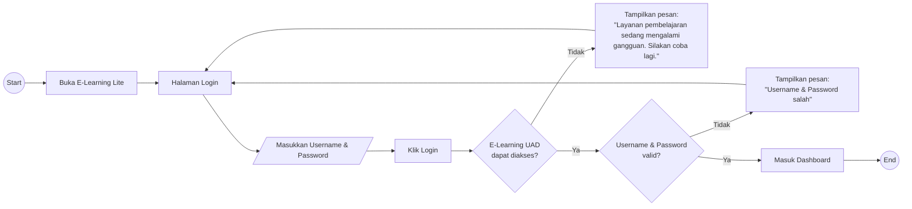

# UF-01 Login Pengguna

## Informasi Umum

| Atribut | Keterangan |
|---|---|
| ID | UF-01 |
| Nama | Login Pengguna |
| Aktor | Mahasiswa |
| Tujuan | Masuk ke dashboard E-Learning Lite menggunakan akun E-Learning UAD/Moodle yang valid. |
| Pemicu | Mahasiswa membuka E-Learning Lite. |
| Prasyarat | Mahasiswa memiliki username dan password E-Learning UAD/Moodle. |
| Hasil akhir | Mahasiswa berhasil masuk ke dashboard atau menerima pesan kegagalan dan kembali ke halaman login. |

## Diagram User Flow

## Alur Utama

1. Mahasiswa membuka E-Learning Lite.
2. Sistem menampilkan halaman login.
3. Mahasiswa memasukkan username dan password akun E-Learning UAD/Moodle.
4. Mahasiswa menekan tombol **Login**.
5. Sistem memeriksa apakah E-Learning UAD/Moodle dapat diakses.
6. Sistem memvalidasi username dan password.
7. Jika kredensial valid, sistem mengarahkan mahasiswa ke dashboard.
8. Alur selesai.

## Alur Alternatif

### A1 - Layanan Pembelajaran Tidak Dapat Diakses

1. Pada langkah 5, layanan pembelajaran tidak dapat diakses.
2. Sistem menampilkan pesan **"Layanan pembelajaran sedang mengalami gangguan. Silakan coba lagi."**.
3. Sistem tetap menampilkan atau mengarahkan mahasiswa kembali ke halaman login.
4. Mahasiswa dapat mencoba login kembali.

### A2 - Username atau Password Tidak Valid

1. Pada langkah 6, username atau password tidak valid.
2. Sistem menampilkan pesan **"Username & Password salah"**.
3. Sistem tetap menampilkan atau mengarahkan mahasiswa kembali ke halaman login.
4. Mahasiswa dapat memperbaiki kredensial dan mencoba login kembali.
