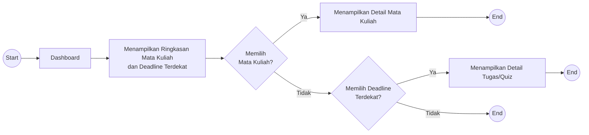

# UF-02 Melihat Ringkasan Mata Kuliah

## Informasi Umum

| Atribut | Keterangan |
|---|---|
| ID | UF-02 |
| Nama | Melihat Ringkasan Mata Kuliah |
| Aktor | Mahasiswa |
| Tujuan | Melihat ringkasan mata kuliah dan deadline terdekat dari dashboard, lalu membuka detail informasi yang dipilih. |
| Pemicu | Mahasiswa membuka dashboard setelah berhasil login. |
| Prasyarat | Mahasiswa telah login dan data mata kuliah tersedia dari E-Learning UAD/Moodle. |
| Hasil akhir | Mahasiswa membuka detail mata kuliah, membuka detail tugas/quiz dari deadline terdekat, atau tetap berada di dashboard tanpa memilih informasi. |

## Diagram User Flow

## Alur Utama

1. Mahasiswa membuka dashboard.
2. Sistem menampilkan ringkasan mata kuliah dan deadline terdekat.
3. Mahasiswa memilih salah satu mata kuliah.
4. Sistem menampilkan detail mata kuliah yang dipilih.
5. Alur selesai.

## Alur Alternatif

### A1 - Memilih Deadline Terdekat

1. Pada langkah 3, mahasiswa tidak memilih mata kuliah.
2. Mahasiswa memilih salah satu deadline terdekat.
3. Sistem menampilkan detail tugas atau quiz yang berkaitan dengan deadline tersebut.
4. Alur selesai.

### A2 - Tidak Memilih Mata Kuliah atau Deadline

1. Mahasiswa tidak memilih mata kuliah.
2. Mahasiswa juga tidak memilih deadline terdekat.
3. Tidak ada perpindahan ke halaman detail dan alur selesai.
