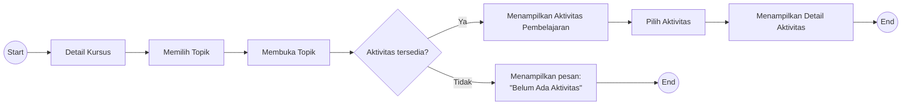

# UF-03 Mengakses Aktivitas Pembelajaran

## Informasi Umum

| Atribut | Keterangan |
|---|---|
| ID | UF-03 |
| Nama | Mengakses Aktivitas Pembelajaran |
| Aktor | Mahasiswa |
| Tujuan | Melihat aktivitas pembelajaran dalam suatu topik dan membuka detail aktivitas yang dipilih. |
| Pemicu | Mahasiswa membuka detail kursus. |
| Prasyarat | Mahasiswa telah login dan memiliki akses ke kursus yang dipilih. |
| Hasil akhir | Mahasiswa membuka detail aktivitas atau menerima informasi bahwa topik belum memiliki aktivitas. |

## Diagram User Flow

## Alur Utama

1. Mahasiswa membuka detail kursus.
2. Mahasiswa memilih topik pembelajaran.
3. Mahasiswa membuka topik tersebut.
4. Sistem memeriksa ketersediaan aktivitas pada topik.
5. Sistem menampilkan daftar aktivitas pembelajaran yang tersedia.
6. Mahasiswa memilih salah satu aktivitas.
7. Sistem menampilkan detail aktivitas yang dipilih.
8. Alur selesai.

## Alur Alternatif

### A1 - Aktivitas Tidak Tersedia

1. Pada langkah 4, sistem tidak menemukan aktivitas pada topik yang dibuka.
2. Sistem menampilkan pesan **"Belum Ada Aktivitas"**.
3. Alur selesai tanpa membuka detail aktivitas.
