# UF-04 Menyelesaikan Materi Pembelajaran

## Informasi Umum

| Atribut | Keterangan |
|---|---|
| ID | UF-04 |
| Nama | Menyelesaikan Materi Pembelajaran |
| Aktor | Mahasiswa |
| Tujuan | Menyelesaikan materi, memperbarui progres pembelajaran, memperoleh poin, dan mendapatkan badge jika ketentuannya terpenuhi. |
| Pemicu | Mahasiswa membuka detail materi pembelajaran. |
| Prasyarat | Mahasiswa telah login, memiliki akses ke kursus, dan dapat membuka materi yang dipilih. |
| Hasil akhir | Status materi dan progres pembelajaran diperbarui, mahasiswa memperoleh 10 poin, serta menerima badge jika memenuhi ketentuan. |

## Diagram User Flow

```mermaid
flowchart LR
    start((Start)) --> materialDetail[Detail Materi Pembelajaran]
    materialDetail --> readMaterial[Membaca Materi]
    readMaterial --> finishAction["Menekan tombol<br/>&quot;Selesai&quot;"]
    finishAction --> materialFinished{Materi selesai?}

    materialFinished -- Tidak --> readMaterial

    materialFinished -- Ya --> updateStatus[Sistem Memperbarui Status Materi]
    updateStatus --> updateProgress[Sistem Memperbarui Progres Pembelajaran]
    updateProgress --> earnPoints[Mendapatkan 10 Poin]
    earnPoints --> checkBadge[Sistem Memeriksa Ketentuan Badge]
    checkBadge --> badgeAchieved{Badge tercapai?}

    badgeAchieved -- Ya --> badgePopup[Pop-up Mendapat Badge Sesuai Ketentuan]
    badgePopup --> badgeEnd((End))

    badgeAchieved -- Tidak --> noBadgeEnd((End))
```

## Alur Utama

1. Mahasiswa membuka detail materi pembelajaran.
2. Mahasiswa membaca materi.
3. Mahasiswa menekan tombol **Selesai**.
4. Sistem memastikan materi telah selesai.
5. Sistem memperbarui status materi.
6. Sistem memperbarui progres pembelajaran mahasiswa.
7. Mahasiswa mendapatkan 10 poin.
8. Sistem memeriksa ketentuan perolehan badge.
9. Jika ketentuan badge terpenuhi, sistem menampilkan pop-up badge yang diperoleh.
10. Alur selesai.

## Alur Alternatif

### A1 - Materi Belum Selesai

1. Pada langkah 4, materi dinyatakan belum selesai.
2. Mahasiswa kembali membaca atau melanjutkan materi.
3. Mahasiswa dapat menekan tombol **Selesai** kembali setelah menyelesaikan materi.

### A2 - Ketentuan Badge Belum Terpenuhi

1. Pada langkah 9, sistem menentukan bahwa ketentuan badge belum terpenuhi.
2. Sistem tidak menampilkan pop-up perolehan badge.
3. Poin, status materi, dan progres pembelajaran yang telah diperbarui tetap berlaku.
4. Alur selesai.
