# UF-05 Mengerjakan dan Mengumpulkan Tugas

## Informasi Umum

| Atribut | Keterangan |
|---|---|
| ID | UF-05 |
| Nama | Mengerjakan dan Mengumpulkan Tugas |
| Aktor | Mahasiswa |
| Tujuan | Mengerjakan dan mengumpulkan tugas sebelum batas waktu, kemudian memperbarui progres serta memperoleh poin dan badge sesuai ketentuan. |
| Pemicu | Mahasiswa membuka detail tugas dan menekan tombol Kerjakan. |
| Prasyarat | Mahasiswa telah login, memiliki akses ke tugas, dan layanan pengumpulan tugas tersedia melalui E-Learning UAD/Moodle. |
| Hasil akhir | Tugas berhasil dikumpulkan dan progres diperbarui, pengumpulan perlu dicoba kembali, atau proses dihentikan karena batas waktu telah lewat. |

## Diagram User Flow

```mermaid
flowchart LR
    start((Start)) --> taskDetail[Detail Tugas]
    taskDetail --> startTask["Menekan tombol<br/>&quot;Kerjakan&quot;"]
    startTask --> canStart{Masih dalam waktu<br/>pengumpulan?}

    canStart -- Tidak --> startExpired["Menampilkan pesan:<br/>&quot;Waktu Pengumpulan Telah Terlewatkan, Tidak Dapat Mengerjakan&quot;"]
    startExpired --> startExpiredEnd((End))

    canStart -- Ya --> workTask[Mengerjakan Tugas]
    workTask --> provideAnswer[/Mengisi atau Mengunggah Jawaban/]
    provideAnswer --> submitTask["Menekan tombol<br/>&quot;Kumpulkan&quot;"]
    submitTask --> canSubmit{Masih dalam waktu<br/>pengumpulan?}

    canSubmit -- Tidak --> submitExpired["Menampilkan pesan:<br/>&quot;Waktu Pengumpulan Telah Terlewatkan, Tidak Dapat Mengumpulkan&quot;"]
    submitExpired --> submitExpiredEnd((End))

    canSubmit -- Ya --> submissionSuccess{Pengumpulan berhasil?}
    submissionSuccess -- Tidak --> provideAnswer

    submissionSuccess -- Ya --> updateStatus[Sistem Memperbarui Status Tugas]
    updateStatus --> updateProgress[Sistem Memperbarui Progres Pembelajaran]
    updateProgress --> earnPoints[Mendapatkan 10 Poin]
    earnPoints --> badgeAchieved{Badge tercapai?}

    badgeAchieved -- Ya --> badgePopup[Pop-up Mendapat Badge Sesuai Ketentuan]
    badgePopup --> badgeEnd((End))

    badgeAchieved -- Tidak --> noBadgeEnd((End))
```

## Alur Utama

1. Mahasiswa membuka detail tugas.
2. Mahasiswa menekan tombol **Kerjakan**.
3. Sistem memastikan tugas masih berada dalam waktu pengumpulan.
4. Mahasiswa mengerjakan tugas.
5. Mahasiswa mengisi atau mengunggah jawaban.
6. Mahasiswa menekan tombol **Kumpulkan**.
7. Sistem memeriksa kembali batas waktu pengumpulan.
8. Sistem memproses dan memastikan pengumpulan berhasil.
9. Sistem memperbarui status tugas.
10. Sistem memperbarui progres pembelajaran mahasiswa.
11. Mahasiswa mendapatkan 10 poin.
12. Sistem memeriksa ketentuan perolehan badge.
13. Jika ketentuan badge terpenuhi, sistem menampilkan pop-up badge yang diperoleh.
14. Alur selesai.

## Alur Alternatif

### A1 - Batas Waktu Telah Lewat Sebelum Tugas Dikerjakan

1. Pada langkah 3, batas waktu pengumpulan telah lewat.
2. Sistem menampilkan pesan **"Waktu Pengumpulan Telah Terlewatkan, Tidak Dapat Mengerjakan"**.
3. Mahasiswa tidak dapat mengerjakan tugas.
4. Alur selesai.

### A2 - Batas Waktu Berakhir Sebelum Tugas Dikumpulkan

1. Pada langkah 7, batas waktu pengumpulan telah lewat.
2. Sistem menampilkan pesan **"Waktu Pengumpulan Telah Terlewatkan, Tidak Dapat Mengumpulkan"**.
3. Jawaban tidak dikumpulkan.
4. Alur selesai.

### A3 - Pengumpulan Gagal

1. Pada langkah 8, pengumpulan tidak berhasil.
2. Sistem mengembalikan mahasiswa ke tahap mengisi atau mengunggah jawaban.
3. Mahasiswa dapat memeriksa jawaban dan mencoba mengumpulkan kembali selama batas waktu masih tersedia.

### A4 - Ketentuan Badge Belum Terpenuhi

1. Pada langkah 13, sistem menentukan bahwa ketentuan badge belum terpenuhi.
2. Sistem tidak menampilkan pop-up perolehan badge.
3. Status tugas, progres pembelajaran, dan poin yang telah diperbarui tetap berlaku.
4. Alur selesai.
