# UF-06 Mengerjakan dan Menyelesaikan Kuis

## Informasi Umum

| Atribut | Keterangan |
|---|---|
| ID | UF-06 |
| Nama | Mengerjakan dan Menyelesaikan Kuis |
| Aktor | Mahasiswa |
| Tujuan | Mengerjakan dan menyelesaikan kuis dalam batas waktu, kemudian memperbarui progres serta memperoleh poin dan badge sesuai ketentuan. |
| Pemicu | Mahasiswa membuka detail kuis dan menekan tombol Kerjakan. |
| Prasyarat | Mahasiswa telah login, memiliki akses ke kuis, dan layanan pengerjaan kuis tersedia melalui E-Learning UAD/Moodle. |
| Hasil akhir | Kuis berhasil diselesaikan dan progres diperbarui, penyelesaian perlu dicoba kembali, atau proses dihentikan karena waktu pengerjaan telah lewat. |

## Diagram User Flow

```mermaid
flowchart LR
    start((Start)) --> quizDetail[Detail Kuis]
    quizDetail --> startQuiz["Menekan tombol<br/>&quot;Kerjakan&quot;"]
    startQuiz --> canStart{Masih dalam waktu<br/>pengerjaan?}

    canStart -- Tidak --> startExpired["Menampilkan pesan:<br/>&quot;Waktu Pengerjaan Telah Terlewatkan, Tidak Dapat Mengerjakan&quot;"]
    startExpired --> startExpiredEnd((End))

    canStart -- Ya --> workQuiz[Mengerjakan Kuis]
    workQuiz --> fillAnswers[/Mengisi Jawaban/]
    fillAnswers --> finishQuiz["Menekan tombol<br/>&quot;Selesai&quot;"]
    finishQuiz --> canFinish{Masih dalam waktu<br/>pengumpulan?}

    canFinish -- Tidak --> finishExpired["Menampilkan pesan:<br/>&quot;Waktu Pengerjaan Telah Terlewatkan, Tidak Dapat Mengerjakan&quot;"]
    finishExpired --> finishExpiredEnd((End))

    canFinish -- Ya --> quizSuccess{Kuis berhasil<br/>diselesaikan?}
    quizSuccess -- Tidak --> fillAnswers

    quizSuccess -- Ya --> updateStatus[Sistem Memperbarui Status Kuis]
    updateStatus --> updateProgress[Sistem Memperbarui Progres Pembelajaran]
    updateProgress --> earnPoints[Mendapatkan 10 Poin]
    earnPoints --> badgeAchieved{Badge tercapai?}

    badgeAchieved -- Ya --> badgePopup[Pop-up Mendapat Badge Sesuai Ketentuan]
    badgePopup --> badgeEnd((End))

    badgeAchieved -- Tidak --> noBadgeEnd((End))
```

## Alur Utama

1. Mahasiswa membuka detail kuis.
2. Mahasiswa menekan tombol **Kerjakan**.
3. Sistem memastikan kuis masih berada dalam waktu pengerjaan.
4. Mahasiswa mengerjakan kuis.
5. Mahasiswa mengisi jawaban.
6. Mahasiswa menekan tombol **Selesai**.
7. Sistem memeriksa kembali batas waktu pengumpulan kuis.
8. Sistem memproses dan memastikan kuis berhasil diselesaikan.
9. Sistem memperbarui status kuis.
10. Sistem memperbarui progres pembelajaran mahasiswa.
11. Mahasiswa mendapatkan 10 poin.
12. Sistem memeriksa ketentuan perolehan badge.
13. Jika ketentuan badge terpenuhi, sistem menampilkan pop-up badge yang diperoleh.
14. Alur selesai.

## Alur Alternatif

### A1 - Waktu Pengerjaan Telah Lewat Sebelum Kuis Dimulai

1. Pada langkah 3, waktu pengerjaan telah lewat.
2. Sistem menampilkan pesan **"Waktu Pengerjaan Telah Terlewatkan, Tidak Dapat Mengerjakan"**.
3. Mahasiswa tidak dapat mengerjakan kuis.
4. Alur selesai.

### A2 - Waktu Berakhir Sebelum Kuis Diselesaikan

1. Pada langkah 7, batas waktu telah lewat.
2. Sistem menampilkan pesan **"Waktu Pengerjaan Telah Terlewatkan, Tidak Dapat Mengerjakan"**.
3. Kuis tidak dapat diselesaikan melalui alur ini.
4. Alur selesai.

### A3 - Penyelesaian Kuis Gagal

1. Pada langkah 8, kuis tidak berhasil diselesaikan.
2. Sistem mengembalikan mahasiswa ke tahap pengisian jawaban.
3. Mahasiswa dapat memeriksa jawaban dan mencoba menyelesaikan kuis kembali selama waktu masih tersedia.

### A4 - Ketentuan Badge Belum Terpenuhi

1. Pada langkah 13, sistem menentukan bahwa ketentuan badge belum terpenuhi.
2. Sistem tidak menampilkan pop-up perolehan badge.
3. Status kuis, progres pembelajaran, dan poin yang telah diperbarui tetap berlaku.
4. Alur selesai.
