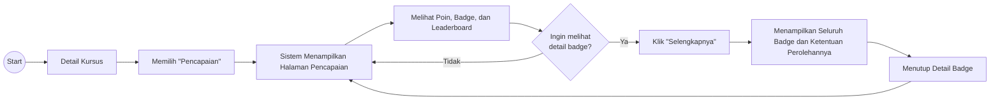

# UF-07 Mengakses Pencapaian

## Informasi Umum

| Atribut | Keterangan |
|---|---|
| ID | UF-07 |
| Nama | Mengakses Pencapaian |
| Aktor | Mahasiswa |
| Tujuan | Melihat poin, badge, leaderboard, serta detail seluruh badge dan ketentuan perolehannya. |
| Pemicu | Mahasiswa memilih menu Pencapaian dari detail kursus. |
| Prasyarat | Mahasiswa telah login, memiliki akses ke kursus, dan data gamifikasi tersedia. |
| Hasil akhir | Mahasiswa melihat ringkasan pencapaian atau detail badge, lalu dapat kembali ke halaman pencapaian. |

## Diagram User Flow

## Alur Utama

1. Mahasiswa membuka detail kursus.
2. Mahasiswa memilih **Pencapaian**.
3. Sistem menampilkan halaman pencapaian.
4. Mahasiswa melihat poin, badge, dan leaderboard.
5. Mahasiswa memilih untuk melihat detail badge.
6. Mahasiswa menekan **Selengkapnya**.
7. Sistem menampilkan seluruh badge beserta ketentuan perolehannya.
8. Mahasiswa menutup detail badge.
9. Sistem kembali menampilkan halaman pencapaian.

## Alur Alternatif

### A1 - Tidak Membuka Detail Badge

1. Pada langkah 5, mahasiswa tidak memilih untuk melihat detail badge.
2. Mahasiswa tetap berada pada halaman pencapaian dan dapat melihat ringkasan poin, badge, serta leaderboard.

### A2 - Membuka Detail Badge Kembali

1. Setelah kembali ke halaman pencapaian pada langkah 9, mahasiswa dapat memilih **Selengkapnya** kembali.
2. Sistem kembali menampilkan seluruh badge beserta ketentuan perolehannya.
