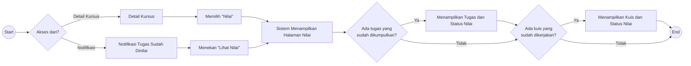

# UF-08 Melihat Nilai

## Informasi Umum

| Atribut | Keterangan |
|---|---|
| ID | UF-08 |
| Nama | Melihat Nilai |
| Aktor | Mahasiswa |
| Tujuan | Melihat tugas yang sudah dikumpulkan dan kuis yang sudah dikerjakan beserta status nilainya pada suatu kursus. |
| Pemicu | Mahasiswa memilih menu Nilai dari detail kursus atau menekan tombol **Lihat Nilai** pada notifikasi tugas yang sudah dinilai. |
| Prasyarat | Mahasiswa telah login, memiliki akses ke kursus, dan halaman nilai dapat diakses. |
| Hasil akhir | Sistem hanya menampilkan tugas yang sudah dikumpulkan dan/atau kuis yang sudah dikerjakan, kemudian alur selesai. |

## Diagram User Flow

## Alur Utama

1. Mahasiswa membuka detail kursus.
2. Mahasiswa memilih **Nilai**.
3. Sistem menampilkan halaman nilai.
4. Sistem memeriksa tugas dengan submission berstatus `submitted`; draft dari tahap pengerjaan atau konfirmasi tidak dianggap sudah dikumpulkan.
5. Sistem menampilkan tugas yang sudah dikumpulkan dengan status **Belum Dinilai** atau **Sudah Dinilai**; tugas yang belum dikumpulkan tidak ditampilkan.
6. Sistem memeriksa kuis yang sudah dikerjakan oleh mahasiswa.
7. Sistem menampilkan kuis yang sudah dikerjakan dengan status nilainya; kuis yang belum dikerjakan tidak ditampilkan.
8. Alur selesai.

## Alur Alternatif

### A1 - Belum Ada Tugas yang Dikumpulkan

1. Pada langkah 4, sistem tidak menemukan tugas yang sudah dikumpulkan.
2. Sistem menampilkan informasi bahwa belum ada tugas yang sudah dikumpulkan dan melanjutkan pemeriksaan kuis.

### A2 - Belum Ada Kuis yang Dikerjakan

1. Pada langkah 6, sistem tidak menemukan kuis yang sudah dikerjakan.
2. Sistem menampilkan informasi bahwa belum ada kuis yang sudah dikerjakan.
3. Tugas yang sudah dikumpulkan tetap ditampilkan.
4. Alur selesai.

### A3 - Belum Ada Tugas yang Dikumpulkan dan Kuis yang Dikerjakan

1. Sistem tidak menemukan tugas yang sudah dikumpulkan maupun kuis yang sudah dikerjakan.
2. Sistem menampilkan empty state pada kedua tab nilai.
3. Alur selesai.

### A4 - Membuka Nilai dari Notifikasi

1. Moodle menyediakan nilai tugas mahasiswa beserta waktu penilaiannya.
2. Sistem memperbarui badge notifikasi pada topbar dari halaman mahasiswa yang sedang dibuka tanpa mewajibkan mahasiswa kembali ke Dashboard.
3. Sistem menampilkan pemberitahuan tugas sudah dinilai pada filter **Semua** dan **Nilai Tugas**, lengkap dengan jumlah notifikasi baru pada kedua filter.
4. Ketika halaman Notifikasi dibuka, sistem tetap menampilkan label **Baru** pada kunjungan tersebut lalu menyimpan status bacanya menggunakan kunci teknis per mahasiswa.
5. Mahasiswa menekan tombol **Lihat Nilai**.
6. Sistem membuka halaman Detail Nilai kursus dengan tab **Tugas** aktif.
7. Sistem menampilkan tugas yang sudah dikumpulkan beserta nilai dan status **Sudah Dinilai**.
