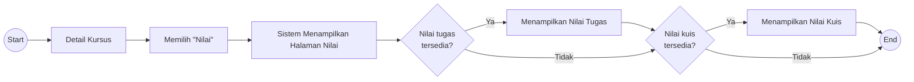

# UF-08 Melihat Nilai

## Informasi Umum

| Atribut | Keterangan |
|---|---|
| ID | UF-08 |
| Nama | Melihat Nilai |
| Aktor | Mahasiswa |
| Tujuan | Melihat nilai tugas dan nilai kuis yang tersedia pada suatu kursus. |
| Pemicu | Mahasiswa memilih menu Nilai dari detail kursus. |
| Prasyarat | Mahasiswa telah login, memiliki akses ke kursus, dan halaman nilai dapat diakses. |
| Hasil akhir | Sistem menampilkan nilai tugas dan/atau nilai kuis yang tersedia, kemudian alur selesai. |

## Diagram User Flow

## Alur Utama

1. Mahasiswa membuka detail kursus.
2. Mahasiswa memilih **Nilai**.
3. Sistem menampilkan halaman nilai.
4. Sistem memeriksa ketersediaan nilai tugas.
5. Jika tersedia, sistem menampilkan nilai tugas.
6. Sistem memeriksa ketersediaan nilai kuis.
7. Jika tersedia, sistem menampilkan nilai kuis.
8. Alur selesai.

## Alur Alternatif

### A1 - Nilai Tugas Tidak Tersedia

1. Pada langkah 4, nilai tugas tidak tersedia.
2. Sistem tidak menampilkan data nilai tugas dan melanjutkan pemeriksaan nilai kuis.

### A2 - Nilai Kuis Tidak Tersedia

1. Pada langkah 6, nilai kuis tidak tersedia.
2. Sistem tidak menampilkan data nilai kuis.
3. Nilai tugas yang tersedia tetap ditampilkan.
4. Alur selesai.

### A3 - Nilai Tugas dan Kuis Tidak Tersedia

1. Sistem tidak menemukan nilai tugas maupun nilai kuis.
2. Tidak ada data nilai yang ditampilkan.
3. Alur selesai.
